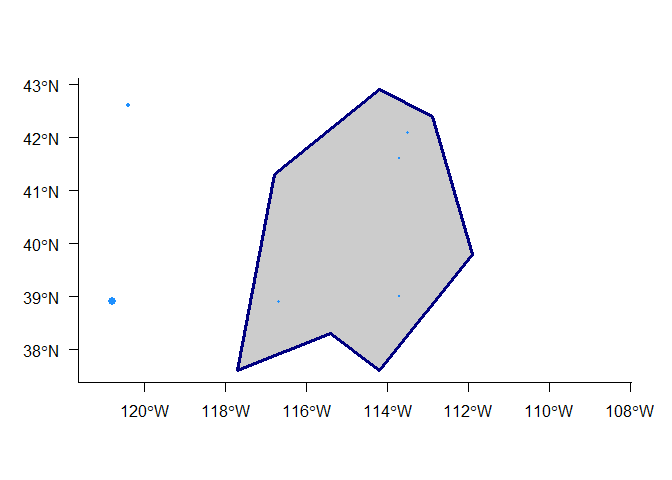

Lab R1
================
Josh Nowak
April 2, 2018

Recipe portion of the lab...Spatial basics
------------------------------------------

Code in this section was taken from [rspatial](http://www.rspatial.org/spatial/rst/3-vectordata.html)

### Prerequisites

``` r
require(sp)
require(raster)
require(tidyr)
require(dplyr)
```

Please create a markdown document to submit your work. To create the document in RStudio

File -&gt; New File -&gt; R Markdown

There will be example text in the new document that opens. This text can be deleted. The cheat sheets linked in the GitHub repository include rmarkdown and may make it easier to work with this tool.

### Spatial Points

``` r
  longitude <- c(-116.7, -120.4, -116.7, -113.5, -115.5, -120.8, -119.5, -113.7, -113.7, -110.7)
  latitude <- c(45.3, 42.6, 38.9, 42.1, 35.7, 38.9, 36.2, 39, 41.6, 36.9)
  lonlat <- cbind(longitude, latitude)
```

1.  What is the class of lonlat?

2.  What is the structure? Is it projected?

``` r
xy_sp <- SpatialPoints(lonlat)
```

1.  What is the class of xy\_sp?...what just happened?

2.  What is the type of xy\_sp? (Hint: S3 or S4) Why do we care?

3.  What is the projection of xy\_sp?

4.  What slots were added to the object that we did not previously create?

``` r
crdref <- CRS('+proj=longlat +datum=WGS84')
xy_sp <- SpatialPoints(lonlat, proj4string = crdref)
```

Adding data is easy...

``` r
df <- tibble::tibble(
  ID = 1:nrow(lonlat),
  elev = runif(nrow(lonlat), 1000, 8000)
)

pts_df <- SpatialPointsDataFrame(
  xy_sp,
  data = df
)
```

1.  What is the difference between pts and pts\_df? What new slot was created?

Subsetting is also easy...

``` r
pts_df[pts_df$elev > 3000,]
```

    ## class       : SpatialPointsDataFrame 
    ## features    : 6 
    ## extent      : -120.8, -110.7, 35.7, 45.3  (xmin, xmax, ymin, ymax)
    ## coord. ref. : +proj=longlat +datum=WGS84 +ellps=WGS84 +towgs84=0,0,0 
    ## variables   : 2
    ## names       : ID,             elev 
    ## min values  :  1, 3213.21571036242 
    ## max values  : 10, 7953.53801245801

``` r
# subset(pts_df, elev > 3000)
```

Conversion back to a dataframe is not so hard...

``` r
as.data.frame(pts_df)
```

    ##    ID     elev longitude latitude
    ## 1   1 4369.533    -116.7     45.3
    ## 2   2 3436.909    -120.4     42.6
    ## 3   3 2316.814    -116.7     38.9
    ## 4   4 2537.322    -113.5     42.1
    ## 5   5 7953.538    -115.5     35.7
    ## 6   6 6501.040    -120.8     38.9
    ## 7   7 3946.655    -119.5     36.2
    ## 8   8 1478.204    -113.7     39.0
    ## 9   9 2065.274    -113.7     41.6
    ## 10 10 3213.216    -110.7     36.9

### Spatial Lines and Polygons

``` r
lon <- c(-116.8, -114.2, -112.9, -111.9, -114.2, -115.4, -117.7)
lat <- c(41.3, 42.9, 42.4, 39.8, 37.6, 38.3, 37.6)
lonlat <- cbind(lon, lat)
```

Create a SpatialLines

``` r
lns <- spLines(lonlat, crs=crdref)
lns
```

    ## class       : SpatialLines 
    ## features    : 1 
    ## extent      : -117.7, -111.9, 37.6, 42.9  (xmin, xmax, ymin, ymax)
    ## coord. ref. : +proj=longlat +datum=WGS84 +ellps=WGS84 +towgs84=0,0,0

Create SpatialPolygons

``` r
pols <- spPolygons(lonlat, crs=crdref)
pols
```

    ## class       : SpatialPolygons 
    ## features    : 1 
    ## extent      : -117.7, -111.9, 37.6, 42.9  (xmin, xmax, ymin, ymax)
    ## coord. ref. : +proj=longlat +datum=WGS84 +ellps=WGS84 +towgs84=0,0,0

Plotting these objects is easy with base R, but other options may make prettier maps.

``` r
par(bty = "l")
plot(pols, axes = TRUE, las = 1)
plot(pols, border = "navy", col = "gray80", lwd = 3, add = TRUE)
points(
  pts_df, 
  col = "dodgerblue", 
  pch = 19, 
  cex = pts_df$elev/max(pts_df$elev) * 1.3
)
```



------------------------------------------------------------------------

### Your turn - Include your code in your response

1.  Create some point data (i.e. xy) that falls within MT. Store the data in a tibble.

2.  Add a column called elevation and randomly assign values between 1000 and 5000.

3.  The object you created is of class tibble. Convert this object to SpatialPointsDataFrame

4.  Why SpatialPointsDataFrame and not SpatialPoints?

5.  Define the projection of your data, WGS84

6.  Plot your spatial data, add

-   Title
-   label the X and Y axes
-   Change the point types to be filled dots
-   Make the dots "dodgerblue"
-   Make the size of the dot reflect the value in the elevation column

1.  Subset your data to those points where elevation is greater than 2000

2.  Plot the subset data as before

3.  Now convert your point data to a raster...rasterize it

-   Hint: ?raster::rasterize

1.  Plot the raster you made and overlay the points from before

------------------------------------------------------------------------

When completed, please print the rendered markdown document and submit it for grading.
