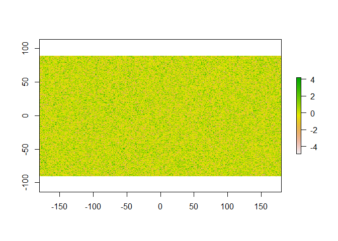
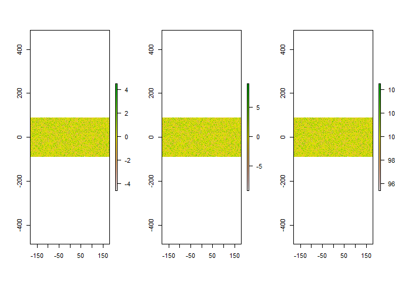
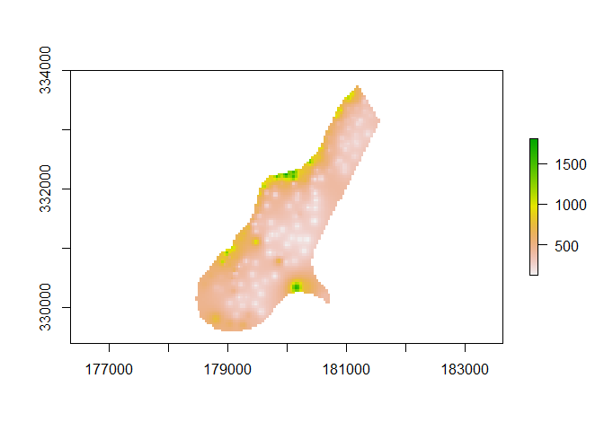

Rasters
================
Josh
April 3, 2018

-   [Review](#review)
    -   [Vector Data](#vector-data)
-   [Rasters](#rasters)
    -   [Rasters can be multi-layered](#rasters-can-be-multi-layered)

Review
------

#### Vector Data

-   SpatialPoints
-   SpatialLines
-   SpatialPolygons
-   SpatialPixels

**Slots**

-   coords
-   bbox
-   proj4string

**Add Attributes**

-   \*DataFrame

**Projections**

-   [spatialreference](www.spatialreference.org)
-   proj4string
-   EPSG

**Conversion**

-   as.data.frame

**Subsetting**

-   \[
-   subset

**Reproject**

-   spTransform

**Read/Write**

-   load/save
-   readOGR/writeOGR
-   raster/writeRaster
-   GDAL via gdalUtils

**Main Packages**

-   sp
-   raster
-   rgdal
-   rgeos
-   tmaps
-   maps
-   maptools
-   rasteVis
-   ggmap
-   googlemaps

------------------------------------------------------------------------

Rasters
-------

``` r
  require(raster)
```

Make our first raster

``` r
  r <- raster()
  r
```

    ## class       : RasterLayer 
    ## dimensions  : 180, 360, 64800  (nrow, ncol, ncell)
    ## resolution  : 1, 1  (x, y)
    ## extent      : -180, 180, -90, 90  (xmin, xmax, ymin, ymax)
    ## coord. ref. : +proj=longlat +datum=WGS84 +ellps=WGS84 +towgs84=0,0,0

``` r
  ncell(r)
```

    ## [1] 64800

``` r
  r[] <- rnorm(ncell(r))
  plot(r)
```



``` r
  hasValues(r)
```

    ## [1] TRUE

``` r
  inMemory(r)
```

    ## [1] TRUE

``` r
ncell(r)
```

    ## [1] 64800

``` r
nrow(r)
```

    ## [1] 180

``` r
ncol(r)
```

    ## [1] 360

``` r
xmax(r)
```

    ## [1] 180

``` r
ymin(r)
```

    ## [1] -90

``` r
res(r)
```

    ## [1] 1 1

``` r
extent(r)
```

    ## class       : Extent 
    ## xmin        : -180 
    ## xmax        : 180 
    ## ymin        : -90 
    ## ymax        : 90

### Rasters can be multi-layered

``` r
r <- raster()
r[] <- rnorm(ncell(r))
r2 <- r * 2
r3 <- r + 100

par(mfrow = c(1, 3))
plot(r)
plot(r2)
plot(r3)
```



``` r
s <- stack(r, r2, r3)
```

*If your raster stack fails to build because the dimensions of the rasters are slightly different, try resample to a reference raster.*

``` r
filename <- system.file("external/test.grd", package = "raster")
r <- raster(filename)
plot(r)
```



``` r
r <- raster(nrow = 5, ncol = 5)
```

    ## Warning in .local(...): partial argument match of 'nrow' to 'nrows'

    ## Warning in .local(...): partial argument match of 'ncol' to 'ncols'

``` r
r[] <- 1:ncell(r)

msk <- raster(nrow = 5, ncol = 5)
```

    ## Warning in .local(...): partial argument match of 'nrow' to 'nrows'

    ## Warning in .local(...): partial argument match of 'ncol' to 'ncols'

``` r
msk[1,] <- 1
msk[,2] <- 1

new_r <- mask(r, msk)
```

Because rasters can be memory hogs it is safer to use the helper functions provided to supply values and summarise.

``` r
r <- raster(nrow = 10, ncol = 10)
```

    ## Warning in .local(...): partial argument match of 'nrow' to 'nrows'

    ## Warning in .local(...): partial argument match of 'ncol' to 'ncols'

``` r
values(r) <- 1:100

#  Not super memory safe or efficient
r_not_3 <- r[r != 3]

# Use cell numbers to extract values
r[4]
```

    ##   
    ## 4

``` r
get_Vals <- c(6, 3, 4, 5)

beginCluster(4)
```

    ## Loading required namespace: parallel

    ## Warning in seq.default(along = new): partial argument match of 'along' to
    ## 'along.with'

    ## Warning in seq.default(along = list): partial argument match of 'along' to
    ## 'along.with'

    ## Warning in seq.default(along = new): partial argument match of 'along' to
    ## 'along.with'

    ## Warning in seq.default(along = cl): partial argument match of 'along' to
    ## 'along.with'

    ## Warning in seq.default(along = new): partial argument match of 'along' to
    ## 'along.with'

    ## Warning in seq.default(along = new): partial argument match of 'along' to
    ## 'along.with'

    ## Warning in seq.default(along = new): partial argument match of 'along' to
    ## 'along.with'

    ## Warning in seq.default(along = new): partial argument match of 'along' to
    ## 'along.with'

``` r
extract(r, matrix(c(1, 1), ncol = 2, nrow = 1), cellnumbers = T)
```

    ##  cells layer
    ##     46    46

``` r
endCluster()
```

``` r
r3 + r2
```

    ## class       : RasterLayer 
    ## dimensions  : 180, 360, 64800  (nrow, ncol, ncell)
    ## resolution  : 1, 1  (x, y)
    ## extent      : -180, 180, -90, 90  (xmin, xmax, ymin, ymax)
    ## coord. ref. : +proj=longlat +datum=WGS84 +ellps=WGS84 +towgs84=0,0,0 
    ## data source : in memory
    ## names       : layer 
    ## values      : 86.17679, 113.4153  (min, max)

``` r
cellStats(r3, "mean")
```

    ## [1] 100.0025

``` r
aggregate(r2, fact = 2, fun = sum)
```

    ## class       : RasterLayer 
    ## dimensions  : 90, 180, 16200  (nrow, ncol, ncell)
    ## resolution  : 2, 2  (x, y)
    ## extent      : -180, 180, -90, 90  (xmin, xmax, ymin, ymax)
    ## coord. ref. : +proj=longlat +datum=WGS84 +ellps=WGS84 +towgs84=0,0,0 
    ## data source : in memory
    ## names       : layer 
    ## values      : -16.63952, 15.84114  (min, max)

Make objects smaller to be more efficient crop(r2, idaho\_shp)

Reclassify or bin your data reclassify

Convert to or from sp rasterize

Area summaries focal zonal

Distance distance gDistance adjency

boundaries area clump
